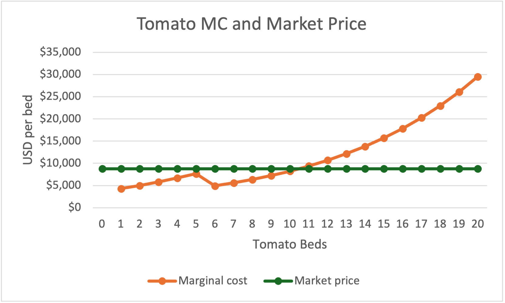
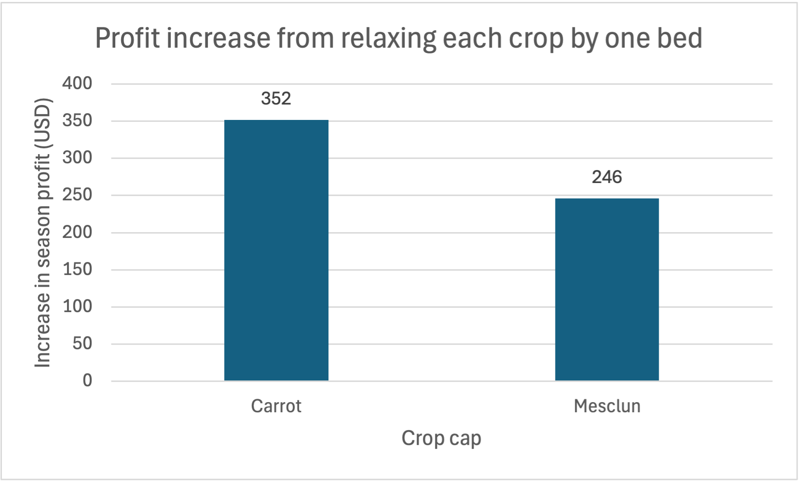

# Perfect Competition Analysis

## Why Tomatoes Stop at 10 Beds

The 10th tomato bed's marginal revenue will exceed the marginal cost by $551 thereby increasing the farm's total profit. The 11th tomato bed's marginal cost will exceed the marginal revenue by $591, decreasing the total profit. The farmer should stop at 10 tomato beds because the next tomato bed would reduce the farm's profits.

(`Marginal-Cost Schedules!F15:G16`)

## Binding and Slack Constraints

The binding constraints are the carrot cap (20/20 beds) and mesclun cap (30/30 beds). Three capacity constraints are slack: the tomato cap (10/20 beds), temporary-worker equivalents (approximately 3.16/4), and total beds available (60/64). A binding constraint has no unused capacity, while a slack constraint does. Tomatoes stop at 10 beds because the 11th bed's marginal cost exceeds its price, not because the tomato cap prevents further planting.

(`Optimization!B5:B7`, `Optimization!B10`, `Optimization!B19`, `Inputs!B6`, `Inputs!B9`, `Marginal-Cost Schedules!F15:G16`)

Carrots (bed 20: MC approximately $1,689 vs. price $2,094) and mesclun (bed 30: MC approximately $2,420 vs. price $2,700) both reach their bed caps while marginal cost remains below price. The cap-relaxation tests confirm that allowing another bed of either crop increases farm profit.

(`Marginal-Cost Schedules!N25:O25`, `Marginal-Cost Schedules!V35:W35`)

Starting from the original baseline each time, relaxing the carrot cap from 20 to 21 beds increases total farm profit by $352.49, while relaxing the mesclun cap from 30 to 31 beds increases it by $246.47. These are the estimated discrete shadow values of the respective caps: the profit gained from permitting one additional bed. Carrot capacity provides $106.02 more benefit, so it should be prioritized when additional expansion costs are comparable.

Figure labels are rounded to the nearest dollar; the text reports the gains to the nearest cent.

## Why Tomato Marginal Cost Dips

When the farm moves to five tomato beds, total labor hours reach 724.73. This uses up the last expensive farmer hours so its marginal cost is relatively high at $7,661. As the sixth bed is added, the farmer has already reached the 720-hour cap. This tells us that the sixth bed's additional 231.91 hours are priced at the cheaper temp rate which causes the marginal cost to fall to $4,906. The dip occurs because the price of the marginal labor input changes, not because the sixth bed requires less labor. The diminishing returns continued because total labor still increased from 724.73 to 956.64 hours.

(`Marginal-Cost Schedules!B10:B11`, `Marginal-Cost Schedules!F10:F11`, `Inputs!B7:B8`, `Inputs!B11`)

## Standalone Losses and Fixed Costs

The carrots and mesclun lose money as each carries the entire fixed cost alone. Carrots contribute $3,511 toward fixed costs while mesclun contributes $8,078 toward fixed costs. However, 10 beds of tomatoes earn about $6,173 alone. The farm pays the $20,000 fixed cost only once and not once for each crop. Since carrots and mesclun have positive contributions after variable costs, growing them improves total farm profit even though neither covers the entire fixed cost alone.

The average variable cost for carrots is $1,918.45 which is below the $2,094.00 price while the average variable cost of mesclun is $2,430.73 which is below the $2,700.00 price. The prices each exceed the average variable costs so revenue covers variable costs and contributes toward unavoidable fixed costs. This supports the continuing production in the short run even when the standalone total profit is negative.

(`Marginal-Cost Schedules!E15:G15`, `Marginal-Cost Schedules!M25:O25`, `Marginal-Cost Schedules!U35:W35`, `Inputs!B5`)

## Comparison with My Original Hypothesis

The model did not support my hypothesis. I overestimated tomato crops by eight beds, underestimated carrot crops by four beds, and was correct with my mesclun value. The tomatoes stopped at 10 beds because the 11th bed's $9,391 marginal cost exceeded its $8,800 price. Carrots rose to 20 because their marginal cost remains below price once they reach the cap. Mesclun remains at 30 because that figure is its binding cap. This is also the same number I had predicted, however, the model arrives there through the constraint rather than through marginal cost catching up to price.
